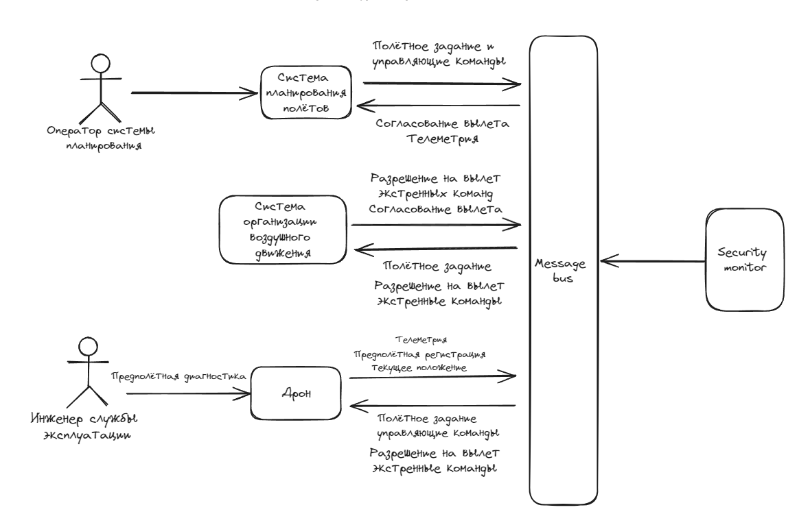

# Отчет о выполнении задачи "Дрон инспекто"

- [Отчет о выполнении задачи "Дрон инспекто"](#отчет-о-выполнении-задачи-дрон-инспекто)
  - [Постановка задачи](#постановка-задачи)
  - [Известные ограничения и вводные](#известные-ограничения-и-вводные)
    - [Цели и Предположения Безопасности (ЦПБ)](#цели-и-предположения-безопасности-цпб)
      - [Цели](#цели)
      - [Предположения](#предположения)
  - [Архитектура решения](#архитектура-решения)
    - [Компоненты](#компоненты)
    - [Алгоритм работы решения](#алгоритм-работы-решения)
      - [Монитор безопасности (security monitor)](#монитор-безопасности-security-monitor)
      - [Система планирования полетов](#система-планирования-полетов)
      - [Система организации воздужного движения](#система-организации-воздужного-движения)
      - [Дрон](#дрон)
  - [Безопасность](#безопасность)
    - [Выполнение целей безопасности](#выполнение-целей-безопасности)
      - [1. Выполняются только аутентичные задания на мониторинг](#1-выполняются-только-аутентичные-задания-на-мониторинг)
      - [2. Выполняются только авторизованные системой ОрВД задания](#2-выполняются-только-авторизованные-системой-орвд-задания)
      - [3. Все манёвры выполняются согласно ограничениям в полётном задании (высота, полётная зона/эшелон)](#3-все-манёвры-выполняются-согласно-ограничениям-в-полётном-задании-высота-полётная-зонаэшелон)
      - [4. Только авторизованные получатели имеют доступ к сохранённым данным фото-видео фиксации](#4-только-авторизованные-получатели-имеют-доступ-к-сохранённым-данным-фото-видео-фиксации)
      - [В случае критического отказа дрон снижается со скоростью не более 1 м/с](#в-случае-критического-отказа-дрон-снижается-со-скоростью-не-более-1-мс)
      - [Для запроса авторизации вылета к системе ОрВД используется только аутентичный идентификатор дрона](#для-запроса-авторизации-вылета-к-системе-орвд-используется-только-аутентичный-идентификатор-дрона)
    - [Компрометация сервисов](#компрометация-сервисов)
      - [компрометация дрона](#компрометация-дрона)
      - [системы планрования полетов](#системы-планрования-полетов)
    - [Рассмотрение других негативных сценариев](#рассмотрение-других-негативных-сценариев)
    - [Итоговые изменения в архитектуре](#итоговые-изменения-в-архитектуре)
  - [Тестирование](#тестирование)
    - [Нормальная работа](#нормальная-работа)
      - [Включение дрона](#включение-дрона)
      - [Получение информации о полете с мобильного телефона](#получение-информации-о-полете-с-мобильного-телефона)
      - [Принудительное возвращение на базу](#принудительное-возвращение-на-базу)
      - [Просмотр журналов управляющего центра об инцидентах](#просмотр-журналов-управляющего-центра-об-инцидентах)
    - [Cheat-запросы и функции](#cheat-запросы-и-функции)
      - [Состояние дрона](#состояние-дрона)
      - [Ошибка GPS навигации](#ошибка-gps-навигации)
      - [Человек под дроном](#человек-под-дроном)
    - [DoS-атака](#dos-атака)
    - [Обработка ошибок](#обработка-ошибок)
    

## Постановка задачи

Задача заключается в реализации ПО дрона, который автономно проводит мониторинг трубопроводов, таким образом, чтобы выполнение задач можно было считать безопасным как с программной точки зрения, так и с физической(безо столкновений и причинение ущерба).

## Известные ограничения и вводные

По условиям организаторов должна использоваться микросервисная архитектура и шина обмена сообщениями для реализации асинхронной работы сервисов.

### Цели и Предположения Безопасности (ЦПБ)

#### Цели 

1. Выполняются только аутентичные задания на мониторинг
2. Выполняются только авторизованные системой ОрВД задания
3. Все манёвры выполняются согласно ограничениям в полётном задании (высота, полётная зона/эшелон)
4. Только авторизованные получатели имеют доступ к сохранённым данным фото-видео фиксации
5. В случае критического отказа дрон снижается со скоростью не более 1 м/с
6. Для запроса авторизации вылета к системе ОрВД используется только аутентичный идентификатор дрона
7. Только авторизованные получатели имеют доступ к оперативной информации

#### Предположения

1. Аутентичная система ОрВД благонадёжна
2. Аутентичные сотрудники благонадёжны и обладают необходимой квалификацией
3. Только авторизованные сотрудники управляют системами
4. Аутентичное полётное задание составлено так, что на всём маршруте дрон может совершить аварийную посадку без причинения неприемлемого ущерба заказчику и третьим лицам

## Архитектура решения

### Компоненты

| Название | Назначение | 
|----|----|
|*Дрон* | Регистрирует БВС и отправляет информацию о местоположении. | 
|*Система планирования полетов*| Регистрация полетного задания. Отправка полетного залания на дрон. Отправляет статус о завершении полета. Отправляет оператору положение дрона и статус мониторинга. Отправляет оператору статус выполнения задания.|
|*Система организации воздушного движения*| Одобрение полета. Подтверждение вылета. |
|*Security monitor* (монитор безопасности)| Авторизует операцию, если она удовлетворяет заданным правилам или блокирует её в противном случае |
|*Message bus*| Брокер - сервис передачи сообщений от источника получателям |

Более подробное описание о функциях компонентов, логике их работы и методах взаимодействия см. ниже

### Алгоритм работы решения

#### Монитор безопасности (security monitor)

Для монитора безопасности был использован брокер сообщений kafka. Брокер сообщений не позволяет передавать и получать информацию у модулей, к которым закрыт доступ через политику конфеденциальности.

??? написать реализацию и логику работы.

#### Система планирования полетов

Реализация: 

Бизнес функции:
1. Проверка совместимости оператора и дрона
2. Проверка валидности задания
3. Отправка полетного задания в ОрВД
4. Отправка полетного задания дрону
5. Получение телеметрии от дрона в процессе выполнения задания
6. Отправка телеметрии **авторизованному** пользователю
7. Отправляет статус о заврешении полета в ОрВД
8. Отправляет статус о выполненной задаче оператору

Какие цели безопасности решает:
- Проверка оператора на доступ управления дроном, решает **цель безопасности №1**, т.к. сотрудник предполагаемо благонадежный, он может по случайности запросить управление не тем дроном.
- Проверка валидности задания при получении нового задания на мониторинг решает **цель безопасности №2**.
- **Цель безопаности №3** решается передачей дроном телеметрии при выполнении задания.
- **Цель безопаности №5** может быть решен передачей дроном телеметрии при выполнении задания.
- **Цель безопаности №7** решается тем, что опреативную информацию мы передаем только авторизованному пользователю

#### Система организации воздужного движения

Реализация:

Бизнес функции:
1. Получает полетное задание
2. Согласовывает вылета
3. Регистрирует БВС
4. Подтверждает вылет дрона
5. Получает информацию о местоположении при выполнении задания
6. Посылает экстренные команды при отклонении от курса

Какие цели безопаност решает:
- **Цель №2** решается согласованием вылета БВС
- **Цель №3** решается передачей дроном информации о расположении
- **Цель №5** решается передачей дроном информации о расположении
- **Цель №6** решается в момент регистрации БВС проверкой идентфикатора дрона в полетном заданиии

#### Дрон

Реализация: 

Бизнес функции:
1. Получает полетное задание
2. Проходит регистрацию БВС в ОрВД
3. Проверка на взлет
4. Передача нформации о местоположении в ОрВд во время выполнения задания
5. Получение экстренных команд из ОрВд
6. Передача телеметрии в систему планирования полетов
7. Получение управляющих команд из системы планрования полетов
8. Отправка статуса завершения задания в систему планирования полетов

Какие цели безопаност решает:
- **Цель №5** решается отправкой о расположении в ОрВД и передачей в систему управления полетом телеметрии

## Безопасность
### Выполнение целей безопасности
Рассмотрим поэтапно каждую цель безопасности.

#### 1. Выполняются только аутентичные задания на мониторинг

Постановка скомпрометирвоанной задачи на мониторинг может по следующим векторам:
1. Оператор запрашивает дрон для нелегетимного задания
2. Система планирования шлет дрону скомпрометированное полетное задаие

Пункты 1 решается предположением безопасности: аутентичные сотрудники благонадежный. Так же система планирования полтеов проверяет имеет ли оператор разрешение на управление конкретным дроном.

#### 2. Выполняются только авторизованные системой ОрВД задания

Данная цель безопасности реализуется с предположением безопасности что система ОрВД благонадежна. Так же чтобы система ОрВД проверяет поступающие от оператора задание на валидность.

#### 3. Все манёвры выполняются согласно ограничениям в полётном задании (высота, полётная зона/эшелон)

Отслеживание местоположения дрона занимается ОрВД и система планирования полетов. Если случится так, что дрон будет скомпрометирован, и полетит "по своим делам", тогда эти модули пошлют экстренную команду/управляющую команду на возвращение/посадку.

#### 4. Только авторизованные получатели имеют доступ к сохранённым данным фото-видео фиксации

?????

#### В случае критического отказа дрон снижается со скоростью не более 1 м/с

Пункт решается функциональныой логикой: когда дрон передает телеметрию в систему планрования полетов идет анализ параметров(скорость, высота, координаты). Если какое-то условие превышаает норму, то дрон снимажается.

#### Для запроса авторизации вылета к системе ОрВД используется только аутентичный идентификатор дрона

Пункт решается проверкой идентификатора дрона при регистрации БВС и последующим разрешением на полет.

### Компрометация сервисов

#### компрометация дрона

#### системы планрования полетов

### Рассмотрение других негативных сценариев

### Итоговые изменения в архитектуре

## Тестирование

### Нормальная работа

Примеры
#### Включение дрона

#### Получение информации о полете с мобильного телефона

Во время полета, а также во время пребывания на базе мобильное приложение может запрашивать статус полета (или просто статус дрона).
Выполнить это можно с помощью следующего запроса:
POST http://localhost:9876/drone_status HTTP/1.1
content-type: application/json
auth: very-secure-token
{
"PIN":"1234",
"drone_password":"password"
}

Для этого запроса также необходим PIN-код от мобильного устройства и пароль от дрона.
Мобильное приложение отправит запрос статуса дрону, а полученный ответ выведет в качестве ответа на REST-запрос. Если дрон выключен (физически), то это будет единственная информация, которую мобильное приложение получит с дрона.
Если дрон включен, но не отправлен на задание, то дрон вернет информацию о своем состоянии (уровень заряда, уровень смеси, состояние устройств текущее местоположение).
Если дрон находится в полете, то мобильное приложение (дополнительно к информации о состоянии дрона) получит информацию о задании: начато задание или дрон только отправляется на стартовую точку, где сейчас находится дрон и какая часть задания (в процентном соотношении) уже выполнена.
Дополнительно, если во время предыдущего полета была обнаружена какая-то ошибка, то дрон вернет информацию и о ней.

#### Принудительное возвращение на базу

Мобильное приложение может принудительно отправить дрон на базу во время задания. Внимание! Такое поведение является инцидентом, так как задание начато, но не выполнено. То есть мобильное приложение и управляющий центр получат информацию об ошибке задания. Вернуть дрон можно с помощью следующего запроса:

POST http://localhost:9876/drone_to_home HTTP/1.1
content-type: application/json
auth: very-secure-token
{
"PIN":"1234",
"drone_password":"password"
}

#### Просмотр журналов управляющего центра об инцидентах
Управляющий центр хранит информацию обо всех произошедших инцидентах всех полетов. Чтобы просмотреть этот журнал, необходимо выполнить следующий запрос:
GET http://localhost:5050/incident_info HTTP/1.1

### Cheat-запросы и функции

Так как в данном проекте был реализован только прототип дрона, для проверки нештатных ситуаций были разработаны cheat-функции и запросы, которые позволяют выполнить эмуляцию ошибок. Про некоторые уже упоминалось ранее, однако здесь они были собраны воедино.

#### Состояние дрона

Как уже говорилось ранее, при включении питания дрона, можно установить его параметры. Но важно дополнительно отметить, что менять эти параметры можно и во время полета. Например, если вы включили дрон и отправили его на задание, то во время выполнения можно выполнить следующий запрос:
POST http://localhost:1234/turn_on HTTP/1.1
content-type: application/json
auth: very-secure-token
{
	"charge":"2"
}

Это будет восприниматься как резкое снижение уровня заряда батареи до 2%. Дрон считает, что на каждые 10 смещений по координатам уходит 1% заряда. Тогда, как только дрону будет необходимо как минимум 20 смещений, чтобы вернуться на базу, он прервет задание, отправит сообщение мобильному приложению и управляющему центру об ошибке и вернется домой.

#### Ошибка GPS навигации

В проекте реализована функция, которая выполняет роль GPS навигации. Для этой функции был создан cheat-флаг, который используется для эмуляции ошибки навигации. Установить этот флаг можно с помощью cheat-запроса:
GET http://localhost:1234/bad_GPS HTTP/1.1

Флаг сбрасывается автоматически.
При ошибке навигации, дрон отправляет информацию об ошибке мобильному приложению и управляющему центру и отправляется на базу.

#### Человек под дроном
В проекте создан прототип функции, который возвращает расстояние от дрона до поверхности земли, чтобы определять, нет ли под дроном человека, животного или здания. Прототип очень примитивен и возвращает всегда одно значение, кроме координаты (5:5). Эта cheat-координата используется для проверки действий дрона, если под ним находится объект.
Дополнительных запросов не требуется.
Если отправить на УЦ следующий запрос, дрон не выполнит задание до конца и вернется на базу с ошибкой:
POST http://localhost:5050/add_task HTTP/1.1
content-type: application/json
auth: very-secure-token
{
"X_start":"1",
"Y_start":"2",
"Z_start":"3",
"X_end":"10",
"Y_end":"11",
"Z_end":"12",
"sign":"IvanovII"
}

Внимание! Данная проверка не актуальная на протяжении движения до старта, так как дрон может пролететь над объектами, пока не началось распыление химикатов.

### DoS-атака

В дроне установлен следующий параметр: если произошло 5 неавторизованных запросов (т.е. с неправильным паролем), то такая ситуация расценивается как DoS-атака и является инцидентом. Дрон отправляется на базу, не закончив задание. 
Внимание! Этот параметр нельзя сбросить вручную, поэтому для сброса необходимо перезапустить докер-образ дрона.
Для возникновения такой ситуации можно выполнить 5 или более следующих запросов с мобильного приложения:
POST http://localhost:9876/drone_work HTTP/1.1
content-type: application/json
auth: very-secure-token
{
"PIN":"1234",
"drone_password":"paссword"
}

Какой именно запрос - неважно, можно также выполнить 5 запросов состояний.

### Обработка ошибок

Во время полета дрона могут наступить следующие проблемы:
1. Состояние дрона не позволяет закончить задание (низкий заряд аккумулятора, неисправность устройств, низкий объем смеси)
2. Задание некорректно
3. Ошибка навигации
4. Объект под дроном (только во время распыления)
5. Принудительное возвращение
6. DoS-атака

Если одна из этих ошибок наступает, то дрон отправляет информацию об ошибке мобильному приложению и управляющему центру. Такие письма будут иметь тип операции "job_error", а также будут включать информацию о типе ошибке (поле "type_error") и дополнительную информацию в зависимости от типа ошибки. Например, процент выполнения задания, координаты, где произошла ошибка и т.п. После отправки сообщения дрон направляется на базу (кроме случая некорректного задания, тут дрон просто не начинает его).
Типы ошибок:
1. Ошибка состояния дрона - "low_charge"
2. Задание некорректно - "bad_task"
3. Ошибка навигации - "GPS_error"
4. Объект под дроном - "human"
5. Принудительное возвращение - "home"
6. DoS-атака - "dos"
