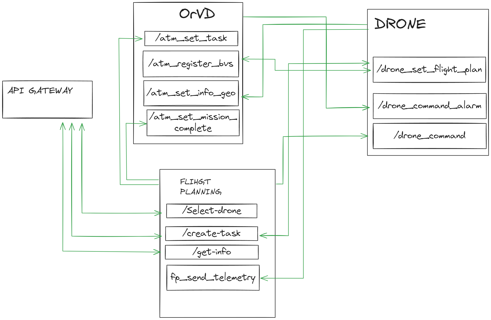

# Отчет о выполнении задачи "Дрон инспекто"

- [Отчет о выполнении задачи "Дрон инспекто"](#отчет-о-выполнении-задачи-дрон-инспекто)
  - [Постановка задачи](#постановка-задачи)
  - [Известные ограничения и вводные](#известные-ограничения-и-вводные)
    - [Цели и Предположения Безопасности (ЦПБ)](#цели-и-предположения-безопасности-цпб)
      - [Цели](#цели)
      - [Предположения](#предположения)
  - [Архитектура решения](#архитектура-решения)
    - [Компоненты](#компоненты)
    - [Алгоритм работы решения](#алгоритм-работы-решения)
    - [Политика безопасности модулей](#политика-безопасности-модулей)
      - [Монитор безопасности (security monitor)](#монитор-безопасности-security-monitor)
      - [Система планирования полетов](#система-планирования-полетов)
      - [Система организации воздужного движенияы](#система-организации-воздужного-движенияы)
      - [Дрон](#дрон)
  - [Безопасность](#безопасность)
    - [Выполнение целей безопасности](#выполнение-целей-безопасности)
      - [1. Выполняются только аутентичные задания на мониторинг](#1-выполняются-только-аутентичные-задания-на-мониторинг)
      - [2. Выполняются только авторизованные системой ОрВД задания](#2-выполняются-только-авторизованные-системой-орвд-задания)
      - [3. Все манёвры выполняются согласно ограничениям в полётном задании (высота, полётная зона/эшелон)](#3-все-манёвры-выполняются-согласно-ограничениям-в-полётном-задании-высота-полётная-зонаэшелон)
      - [В случае критического отказа дрон снижается со скоростью не более 1 м/с](#в-случае-критического-отказа-дрон-снижается-со-скоростью-не-более-1-мс)
      - [Для запроса авторизации вылета к системе ОрВД используется только аутентичный идентификатор дрона](#для-запроса-авторизации-вылета-к-системе-орвд-используется-только-аутентичный-идентификатор-дрона)
  - [Тестирование](#тестирование)
    - [Нормальная работа](#нормальная-работа)

## Постановка задачи

Задача заключается в реализации ПО дрона, который автономно проводит мониторинг трубопроводов, таким образом, чтобы выполнение задач можно было считать безопасным как с программной точки зрения, так и с физической(безо столкновений и причинение ущерба).

## Известные ограничения и вводные

По условиям организаторов должна использоваться микросервисная архитектура и шина обмена сообщениями для реализации асинхронной работы сервисов.

### Цели и Предположения Безопасности (ЦПБ)

#### Цели 

1. Выполняются только аутентичные задания на мониторинг
2. Выполняются только авторизованные системой ОрВД задания
3. Все манёвры выполняются согласно ограничениям в полётном задании (высота, полётная зона/эшелон)
4. Только авторизованные получатели имеют доступ к сохранённым данным фото-видео фиксации
5. В случае критического отказа дрон снижается со скоростью не более 1 м/с
6. Для запроса авторизации вылета к системе ОрВД используется только аутентичный идентификатор дрона
7. Только авторизованные получатели имеют доступ к оперативной информации


#### Предположения

1. Аутентичная система ОрВД благонадёжна
2. Аутентичные сотрудники благонадёжны и обладают необходимой квалификацией
3. Только авторизованные сотрудники управляют системами
4. Аутентичное полётное задание составлено так, что на всём маршруте дрон может совершить аварийную посадку без причинения неприемлемого ущерба заказчику и третьим лицам


## Архитектура решения

### Компоненты

| Название | Назначение | 
|----|----|
|*Дрон* | Регистрирует БВС и отправляет информацию о местоположении. | 
|*Система планирования полетов*| Регистрация полетного задания. Отправка полетного залания на дрон. Отправляет статус о завершении полета. Отправляет оператору положение дрона и статус мониторинга. Отправляет оператору статус выполнения задания.|
|*Система организации воздушного движения*| Одобрение полета. Подтверждение вылета. |
|*Security monitor* (монитор безопасности)| Авторизует операцию, если она удовлетворяет заданным правилам или блокирует её в противном случае |
|*Message bus*| Брокер - сервис передачи сообщений от источника получателям |

Более подробное описание о функциях компонентов, логике их работы и методах взаимодействия см. ниже


### Алгоритм работы решения


### Политика безопасности модулей



#### Монитор безопасности (security monitor)

Для монитора безопасности был использован брокер сообщений kafka. Брокер сообщений не позволяет передавать и получать информацию у модулей, к которым закрыт доступ через политику конфеденциальности.

Монитор безопасности обрабатывает только авторизованные сообщения(сообщения с jwt token'ом). Для этого был реализован специальный сервис. Сперва мы запрашиваем у сервиса авторизации токен по REST API, затем все сервисы проверяют наличие и валидность этого токена через сервис авторизации.

#### Система планирования полетов

Бизнес функции:
1. Проверка совместимости оператора и дрона
2. Проверка валидности задания
3. Отправка полетного задания в ОрВД
4. Отправка полетного задания дрону
5. Получение телеметрии от дрона в процессе выполнения задания
6. Отправка телеметрии **авторизованному** пользователю
7. Отправляет статус о заврешении полета в ОрВД
8. Отправляет статус о выполненной задаче оператору

Какие цели безопасности решает:
- Проверка оператора на доступ управления дроном, решает **цель безопасности №1**, т.к. сотрудник предполагаемо благонадежный, он может по случайности запросить управление не тем дроном.
- Проверка валидности задания при получении нового задания на мониторинг решает **цель безопасности №2**.
- **Цель безопаности №3** решается передачей дроном телеметрии при выполнении задания.
- **Цель безопаности №5** может быть решен передачей дроном телеметрии при выполнении задания.
- **Цель безопаности №7** решается тем, что опреативную информацию мы передаем только авторизованному пользователю

#### Система организации воздужного движенияы

Бизнес функции:
1. Получает полетное задание
2. Согласовывает вылета
3. Регистрирует БВС
4. Подтверждает вылет дрона
5. Получает информацию о местоположении при выполнении задания
6. Посылает экстренные команды при отклонении от курса

Какие цели безопаност решает:
- **Цель №2** решается согласованием вылета БВС
- **Цель №3** решается передачей дроном информации о расположении
- **Цель №5** решается передачей дроном информации о расположении
- **Цель №6** решается в момент регистрации БВС проверкой идентфикатора дрона в полетном заданиии

#### Дрон

Бизнес функции:
1. Получает полетное задание
2. Проходит регистрацию БВС в ОрВД
3. Проверка на взлет
4. Передача нформации о местоположении в ОрВд во время выполнения задания
5. Получение экстренных команд из ОрВд
6. Передача телеметрии в систему планирования полетов
7. Получение управляющих команд из системы планрования полетов
8. Отправка статуса завершения задания в систему планирования полетов

Какие цели безопаност решает:
- **Цель №5** решается отправкой о расположении в ОрВД и передачей в систему управления полетом телеметрии


## Безопасность
### Выполнение целей безопасности
Рассмотрим поэтапно каждую цель безопасности.

#### 1. Выполняются только аутентичные задания на мониторинг

Постановка скомпрометирвоанной задачи на мониторинг может по следующим векторам:
1. Оператор запрашивает дрон для нелегетимного задания
2. Система планирования шлет дрону скомпрометированное полетное задаие

Пункты 1 решается предположением безопасности: аутентичные сотрудники благонадежный. Так же система планирования полтеов проверяет имеет ли оператор разрешение на управление конкретным дроном.

#### 2. Выполняются только авторизованные системой ОрВД задания

Данная цель безопасности реализуется с предположением безопасности что система ОрВД благонадежна. Так же чтобы система ОрВД проверяет поступающие от оператора задание на валидность.

#### 3. Все манёвры выполняются согласно ограничениям в полётном задании (высота, полётная зона/эшелон)

Отслеживание местоположения дрона занимается ОрВД и система планирования полетов. Если случится так, что дрон будет скомпрометирован, и полетит "по своим делам", тогда эти модули пошлют экстренную команду/управляющую команду на возвращение/посадку.

#### В случае критического отказа дрон снижается со скоростью не более 1 м/с

Пункт решается функциональныой логикой: когда дрон передает телеметрию в систему планрования полетов идет анализ параметров(скорость, высота, координаты). Если какое-то условие превышаает норму, то дрон снимажается.

#### Для запроса авторизации вылета к системе ОрВД используется только аутентичный идентификатор дрона

Пункт решается проверкой идентификатора дрона при регистрации БВС и последующим разрешением на полет.

## Тестирование

Тестирование проивзодится после поднятие докера и всех серверов(см. файл README.md)

### Нормальная работа
1. Получение токена

```
curl --location 'http://127.0.0.1:3000/auth/login' \
--header 'Content-Type: application/json' \
--data-raw '{
    "email": "cyber@sec.com",
    "password": "12345678"
}'
```

2. Отправить REST запрос /select-dron

Далее для тестрования отправк сообщений в кафке приведем кейс отправки сообщеня:

1. Перейти на http://localhost:8080/
2. Выбрать вкладку topics
3. Выбрать тописк с названием /drone_set_flight_plan
4. Нажать кнопку produce Message
5. Вставить в value

```
{
    "id": "213821ghdhdhq",
    "name": "TEST",
    "description": "Test flight plan",
    "accessToken": <accessToken>
}

```

6. Нажать produce message


7. Проверить в терминале, что логика отработала.
